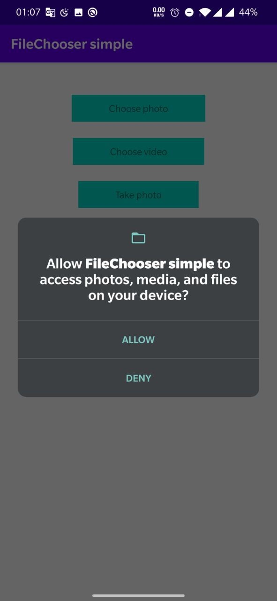
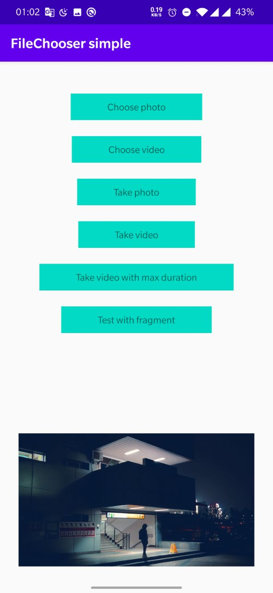
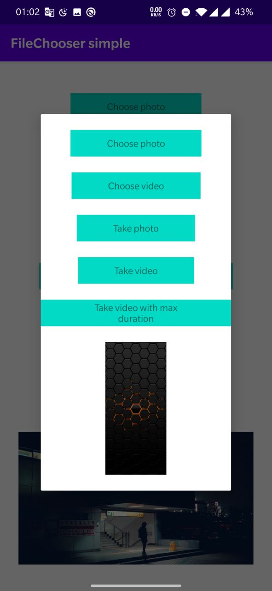

# Android File Chooser 

### Installation

Add this to your ```build.gradle``` file

```
repositories {
    maven {
        url "https://jitpack.io"
    }
}

dependencies {
    implementation 'com.github.babayevsemid:FileChooser:1.0.4'
     
     //required
    implementation "androidx.activity:activity:1.2.0-rc01"
    implementation "androidx.fragment:fragment:1.3.0-beta02"
}
```
### Use in activity

```
val fileChooser = FileChooserActivity(this) 
 fileChooser.fileLiveData
            .observe(this, Observer {
               //Selected your photo
               //it.path
               //it.type
            })
 fileChooser.requestFile(FileTypeEnum.CHOOSE_PHOTO)

``` 

### Use in fragment with check permission

```
val fileChooser = FileChooserFragment(this)
fileChooser.permissionLiveData
            .observe(viewLifecycleOwner, Observer {
                if (it) {
                    //Granted
                } else {
                    //Deny
                }
            })
 fileChooser.fileLiveData
            .observe(viewLifecycleOwner, Observer {
               //Created your photo
               //it.path
               //it.type
            })
 fileChooser.requestFile(FileTypeEnum.TAKE_PHOTO)

``` 
 

### Delete the created files when the application is created
```
class App : Application() {
    override fun onCreate() {
        super.onCreate()

        FileChooserFragment.deleteTakeFiles(this)
    }
}
```

### FileTypeEnum

``` 
  enum class FileTypeEnum {
        CHOOSE_VIDEO,
        CHOOSE_PHOTO,
        TAKE_VIDEO,
        TAKE_PHOTO
  }
        
```

### Video set max second (15 second)

``` 
    fileChooser.requestFile(FileTypeEnum.TAKE_VIDEO, 15)
        
```

### You can check also other permissions

``` 
    fileChooser.manualPermissionLiveData
            .observe(this, Observer {
                println("Permission isGranted $it")
            })
    fileChooser.requestPermission(Manifest.permission.ACCESS_COARSE_LOCATION)
        
```


``` 
    fileChooser.manualMultiPermissionLiveData
            .observe(this, Observer {
                println("Permission isGranted $it")
            })
            
    fileChooser.multiRequestPermission(
            arrayOf(
                Manifest.permission.ACCESS_COARSE_LOCATION,
                Manifest.permission.WRITE_EXTERNAL_STORAGE
            )
        )
        
```






 
